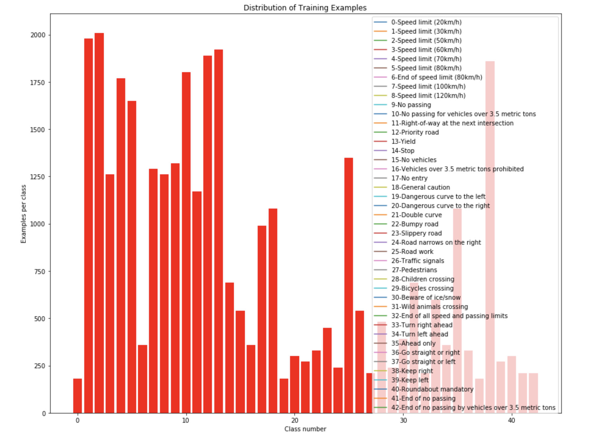
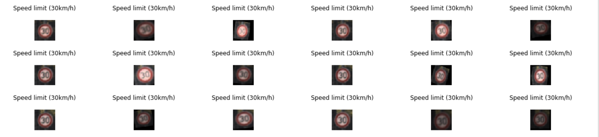

**Traffic Sign Recognition**
============================

###  

**Build a Traffic Sign Recognition Project**

The goals / steps of this project are the following:

\* Load the data set (see below for links to the project data set)

\* Explore, summarize and visualize the data set

\* Design, train and test a model architecture

\* Use the model to make predictions on new images

\* Analyze the softmax probabilities of the new images \* Summarize the results
with a written report

 

**Data Set Summary & Exploration**
----------------------------------

**Files Submitted**

writeup.md

readme.md

Traffic_Sign_Classifier.ipynb

additional_test_images ( folder )

 

**Data Set Summary & Exploration**
----------------------------------

### **1. Basic Summary**

~~~~~~~~~~~~~~~~~~~~~~~~~~~~~~~~~~~~~~~~~~~~~~~~~~~~~~~~~~~~~~~~~~~~~~~~~~~~~~~~
Number of training examples = 34799
Number of validation examples = 4410
Number of testing examples = 12630
Image data shape = (32, 32)
Number of classes = 43
~~~~~~~~~~~~~~~~~~~~~~~~~~~~~~~~~~~~~~~~~~~~~~~~~~~~~~~~~~~~~~~~~~~~~~~~~~~~~~~~

 

### **2. Exploratory visualization**

**Design and Test a Model Architecture**
----------------------------------------

### **1. Image data preprocessing**

The Images are for the initial training only Normalized used the Min-Max
Formula:

~~~~~~~~~~~~~~~~~~~~~~~~~~~~~~~~~~~~~~~~~~~~~~~~~~~~~~~~~~~~~~~~~~~~~~~~~~~~~~~~
def normalize_color_scale(image_data):
    a = -0.5
    b = +0.5
    color_min = np.min(image_data)
    color_max = np.max(image_data)
    return a + ( ( (image_data - color_min)*(b - a) )/( color_max - color_min ) )
~~~~~~~~~~~~~~~~~~~~~~~~~~~~~~~~~~~~~~~~~~~~~~~~~~~~~~~~~~~~~~~~~~~~~~~~~~~~~~~~

 

### **2. Model architecture**

My final model consisted of the following layers:

| Layer               | Operation                         | Description                                  |
|---------------------|-----------------------------------|----------------------------------------------|
| Input               |                                   | 32x32x3 RGB image                            |
| Layer1              | Convolution 5x5                   | 1x1 stride, VALID padding, outputs 32x32x64  |
| Layer1              | RELU                              |                                              |
| Layer1              | Avg pooling                       | 2x2 stride, outputs 14x14x64                 |
|                     |                                   |                                              |
| **Convolution 1x1** | **Convolution 1x1**               | 1x1 stride, VALID padding, outputs 14x14x64  |
| **Convolution 1x1** | RELU                              |                                              |
|                     |                                   |                                              |
| Layer2              | Convolution 5x5                   | 1x1 stride, VALID padding, outputs 10x10x128 |
| Layer2              | RELU                              |                                              |
| Layer2              | Avg pooling                       | 2x2 stride, outputs 5x5x64                   |
|                     |                                   |                                              |
| Flatten             | Flatten                           | 3200                                         |
|                     |                                   |                                              |
| Layer 3             | Fully connected                   | input 3200 output 400.                       |
| Layer 3             | RELU                              |                                              |
| Layer 3             | Dropout                           | ( keep_prob  )                               |
|                     |                                   |                                              |
| Layer 4             | Fully connected                   | input 400 output 200.                        |
| Layer 4             | RELU                              |                                              |
| Layer 4             | Dropout                           | ( keep_prob  )                               |
|                     |                                   |                                              |
| Layer 5             | Fully connected                   | input 200 output 43.                         |
|                     |                                   |                                              |
| cross_entropy       | softmax_cross_entropy_with_logits |                                              |
| optimizer           | AdamOptimizer                     |                                              |

 

### **3. Model trainings:**

####  

 

### **4. Getting the validation set accuracy to be at least 0.93. **

To get the validation accuracy more than 0.93 i went with data images
augmentation.

I have applied some rotation, translation, shear and camera brightness.

This is to force the network to learn to recognize signs that are from different
prospectives or/and are less readable ( example when raining or when the sun
shines )

I have created a new dataset into a numpy array, containing the original images
+ 2 additional augmented images for each original image.

Here you can see an example of augmentation:

 

 

and here the dataset summary:

~~~~~~~~~~~~~~~~~~~~~~~~~~~~~~~~~~~~~~~~~~~~~~~~~~~~~~~~~~~~~~~~~~~~~~~~~~~~~~~~
Augmenting 10000 of 34799
 Augmenting 20000 of 34799
 Augmenting 30000 of 34799
 Images augmented . Size before 34799, size after 104397
~~~~~~~~~~~~~~~~~~~~~~~~~~~~~~~~~~~~~~~~~~~~~~~~~~~~~~~~~~~~~~~~~~~~~~~~~~~~~~~~

 
-

And now the network trainings on the Augmented images:

 

 

**Test a Model on New Images**
------------------------------

### 1. Choose five German traffic signs found on the web and provide them in the report. 

Here are five German traffic signs that I found on the web + some real images
from my cam:

~   alt text

~   alt text

~   alt text

**The first image might be difficult to classify because ...**

 

### 2. Discuss the model's predictions on these new traffic signs and compare the results to predicting on the test set. At a minimum, discuss what the predictions were, the accuracy on these new predictions, and compare the accuracy to the accuracy on the test set (OPTIONAL: Discuss the results in more detail as described in the "Stand Out Suggestions" part of the rubric).

Here are the results of the prediction:

| Image         | Prediction    |
|---------------|---------------|
| Stop Sign     | Stop sign     |
| U-turn        | U-turn        |
| Yield         | Yield         |
| 100 km/h      | Bumpy Road    |
| Slippery Road | Slippery Road |

The model was able to correctly guess 4 of the 5 traffic signs, which gives an
accuracy of 80%. This compares favorably to the accuracy on the test set of ...

 

### 3. FIRST 5 SOFTMAX PROBABILITIES

 

**(Optional) Visualizing the Neural Network **
----------------------------------------------

 
