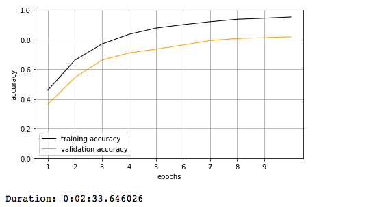
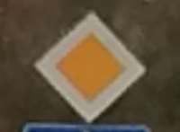

**Traffic Sign Recognition**
============================

###  

**Build a Traffic Sign Recognition Project**

The goals / steps of this project are the following:

\* Load the data set (see below for links to the project data set)

\* Explore, summarize and visualize the data set

\* Design, train and test a model architecture

\* Use the model to make predictions on new images

\* Analyze the softmax probabilities of the new images \* Summarize the results
with a written report

 

**Data Set Summary & Exploration**
----------------------------------

**Files Submitted**

writeup.md

readme.md

Traffic_Sign_Classifier.ipynb

additional_test_images ( folder )

 

**Data Set Summary & Exploration**
----------------------------------

### **1. Basic Summary**

~~~~~~~~~~~~~~~~~~~~~~~~~~~~~~~~~~~~~~~~~~~~~~~~~~~~~~~~~~~~~~~~~~~~~~~~~~~~~~~~
Number of training examples = 34799
Number of validation examples = 4410
Number of testing examples = 12630
Image data shape = (32, 32)
Number of classes = 43
~~~~~~~~~~~~~~~~~~~~~~~~~~~~~~~~~~~~~~~~~~~~~~~~~~~~~~~~~~~~~~~~~~~~~~~~~~~~~~~~

 

### **2. Exploratory visualization**

**Design and Test a Model Architecture**
----------------------------------------

### **1. Image data preprocessing**

The Images are for the initial training only Normalized used the Min-Max
Formula:

~~~~~~~~~~~~~~~~~~~~~~~~~~~~~~~~~~~~~~~~~~~~~~~~~~~~~~~~~~~~~~~~~~~~~~~~~~~~~~~~
def normalize_color_scale(image_data):
    a = -0.5
    b = +0.5
    color_min = np.min(image_data)
    color_max = np.max(image_data)
    return a + ( ( (image_data - color_min)*(b - a) )/( color_max - color_min ) )
~~~~~~~~~~~~~~~~~~~~~~~~~~~~~~~~~~~~~~~~~~~~~~~~~~~~~~~~~~~~~~~~~~~~~~~~~~~~~~~~

 

### **2. Model architecture**

I have choosed in My model to implement the Lenet network adding a Convolution
1x1, and adding more filters on the Layer1 Convolution ( 32x32x64 as output ),
and also on the Layer2 convolution (10x10x128)

 

As Loss function I have tried both the Mean of Cross Entropies, and the L2_Loss
( sum of squared entropies /2 )

My final model consisted of the following layers:

| Layer               | Operation                         | Description                                  |
|---------------------|-----------------------------------|----------------------------------------------|
| Input               |                                   | 32x32x3 RGB image                            |
| Layer1              | Convolution 5x5                   | 1x1 stride, VALID padding, outputs 32x32x64  |
| Layer1              | RELU                              |                                              |
| Layer1              | Avg pooling                       | 2x2 stride, outputs 14x14x64                 |
|                     |                                   |                                              |
| **Convolution 1x1** | **Convolution 1x1**               | 1x1 stride, VALID padding, outputs 14x14x64  |
| **Convolution 1x1** | RELU                              |                                              |
|                     |                                   |                                              |
| Layer2              | Convolution 5x5                   | 1x1 stride, VALID padding, outputs 10x10x128 |
| Layer2              | RELU                              |                                              |
| Layer2              | Avg pooling                       | 2x2 stride, outputs 5x5x64                   |
|                     |                                   |                                              |
| Flatten             | Flatten                           | 3200                                         |
|                     |                                   |                                              |
| Layer 3             | Fully connected                   | input 3200 output 400.                       |
| Layer 3             | RELU                              |                                              |
| Layer 3             | Dropout                           | ( keep_prob )                                |
|                     |                                   |                                              |
| Layer 4             | Fully connected                   | input 400 output 200.                        |
| Layer 4             | RELU                              |                                              |
| Layer 4             | Dropout                           | ( keep_prob )                                |
|                     |                                   |                                              |
| Layer 5             | Fully connected                   | input 200 output 43.                         |
|                     |                                   |                                              |
| cross_entropy       | softmax_cross_entropy_with_logits |                                              |
| optimizer           | AdamOptimizer                     |                                              |

 

### **3. Model trainings:**

As you can see below I have decided for a trainin rate very small 0.0001,
because I prefer to do more epochs ( altough it takes longer ) , but to adjust
the weights slower.

 

Overall the problem here is that the Network learn very quickly to fit the
Training Dataset, but when it comes to validation dataset, the fit is not quite
good enogh ( should be at least 0.93 to pass the test ).

I have tried introducing dropouts from 10% to 70%, it helps but not enough.

As you can see later the solution is to Augment the images introducing rotation
and other effects...

 

#### **The first try is by using a drop of 10% , learning rage of 0.0001 , 10 epochs, and a batch_size of 256:**

loss_operation = **tf.reduce_mean**(cross_entropy)

EPOCH 10 ... Training ( Loss= 0.180, Acc= 0.951 ) Validation ( Loss= 0.661, Acc=
0.818 )

As you can see the Accuracy on the training is .95 quite high, but the model is
overfitting so it is not able to predict on the Validation set correctly ( .81 ,
too low )

 

#### **The second try is by using increasing the epochs from 10 to 50 ( other parameters remain the same )**

loss_operation = **tf.reduce_mean**(cross_entropy)

EPOCH 10 ... Training ( Loss= 0.182, Acc= 0.951 ) Validation ( Loss= 0.575, Acc=
0.840 )  
EPOCH 20 ... Training ( Loss= 0.067, Acc= 0.983 ) Validation ( Loss= 0.464, Acc=
0.877 )  
EPOCH 30 ... Training ( Loss= 0.029, Acc= 0.993 ) Validation ( Loss= 0.443, Acc=
0.893 )  
EPOCH 40 ... Training ( Loss= 0.016, Acc= 0.996 ) Validation ( Loss= 0.434, Acc=
0.895 )  
EPOCH 50 ... Training ( Loss= 0.009, Acc= 0.998 ) Validation ( Loss= 0.450,
**Acc= 0.898** )

 

More epochs… more optimization cycles … so that the Training accuracy is now
.**998** and the validation accuracy is .**898** .. a little bit better but
still two much divergence between .**998** and .**898**

 

#### **The third is by using the L2_LOSS instead of the mean cross entropy**

loss_operation = tf.nn.l2_loss(cross_entropy)

EPOCH 10 ... Training ( Loss= 49.255, Acc= 0.928 ) Validation ( Loss= 195.101,
Acc= 0.795 )  
EPOCH 20 ... Training ( Loss= 14.441, Acc= 0.976 ) Validation ( Loss= 186.962,
Acc= 0.846 )  
EPOCH 30 ... Training ( Loss= 6.690, Acc= 0.987 ) Validation ( Loss= 201.443,
Acc= 0.857 )  
EPOCH 40 ... Training ( Loss= 4.747, Acc= 0.991 ) Validation ( Loss= 186.947,
Acc= 0.873 )  
EPOCH 50 ... Training ( Loss= 2.355, Acc= 0.995 ) Validation ( Loss= 188.300,
**Acc= 0.883** )

 

**But as we can see the L2_LOSS doesn’t make any touchable difference**

**​**

### **4. Getting the validation set accuracy to be at least 0.93.**

To get the validation accuracy more than 0.93 i went with **data images
augmentation.**

I have applied some **rotations**, **translations**, **shears** and **camera
brightnesses**.

This is to **force the network to learn to recognize signs** that are from
different prospectives or/and are less readable ( example when raining or when
the sun shines )

I have created a new dataset into a numpy array, containing the original images
+ 2 additional augmented images for each original image.

Here you can see an example of augmentation:

 

 

and here the dataset summary:

~~~~~~~~~~~~~~~~~~~~~~~~~~~~~~~~~~~~~~~~~~~~~~~~~~~~~~~~~~~~~~~~~~~~~~~~~~~~~~~~
Augmenting 10000 of 34799
 Augmenting 20000 of 34799
 Augmenting 30000 of 34799
 Images augmented . Size before 34799, size after 104397
~~~~~~~~~~~~~~~~~~~~~~~~~~~~~~~~~~~~~~~~~~~~~~~~~~~~~~~~~~~~~~~~~~~~~~~~~~~~~~~~

 
-

### **And now the network trainings on the Augmented images:**

 

**l2 loss , drop 50% ..50 epochs -- learning rate 0.0001**

EPOCH 10 ... Training ( Loss= 201.824, Acc= 0.751 ) Validation ( Loss= 193.306,
Acc= 0.758 )  
EPOCH 20 ... Training ( Loss= 84.293, Acc= 0.876 ) Validation ( Loss= 133.770,
Acc= 0.848 )  
EPOCH 30 ... Training ( Loss= 43.262, Acc= 0.929 ) Validation ( Loss= 114.976,
Acc= 0.888 )  
EPOCH 40 ... Training ( Loss= 25.743, Acc= 0.953 ) Validation ( Loss= 99.059,
Acc= 0.906 )  
EPOCH 50 ... Training ( Loss= 17.973, Acc= 0.967 ) Validation ( Loss= 124.102,
Acc= **0.918** )

**Quite good… but it is still not enough ( .918 ).**

The ​Training accuracy is ( .967 ) and the Validation (.918 )

These two numbers should be as closed as possible to each other.

It means that the network is a little bit **OVER-FITTING.**

 

**trying with more epochs...100 epochs and adjusting the learning rate from
0.0001 to 0.001:**

I think and other problem was also that the learning rate was too small , it
means longer to train.. too long.

 

 

**​**

 

 

 

 

**Test a Model on New Images**
------------------------------

### 1. Choose five German traffic signs found on the web and provide them in the report.

Here are five German traffic signs that I found on the web + some real images
from my cam:

1

2

3

4

5

6

7

8

9

10

11

 

 

**The 2nd might be difficult to classify because of the men drawing inside .**

**The 6th might be difficult because is a “destroyed” sign**

 

Here are the results of the prediction:

| Number | Image                                        | Prediction |
|--------|----------------------------------------------|------------|
| 1      | Speed limit 50 km/h                          |            |
| 2      | No Passing                                   |            |
| 3      | No passing for vehicles over 3.5 metric tons |            |
| 4      | Priority Road                                |            |
| 5      | Yield                                        |            |
| 6      | Yield                                        |            |
| 7      | Stop                                         |            |
| 8      | Stop                                         |            |
| 9      | No Passing                                   |            |
| 10     | Road Work                                    |            |
| 11     | Pedestrians                                  |            |

 

The model was able to correctly guess 4 of the 5 traffic signs, which gives an
accuracy of 80%. This compares favorably to the accuracy on the test set of ...

 

### 3. FIRST 5 SOFTMAX PROBABILITIES

 

**(Optional) Visualizing the Neural Network**
---------------------------------------------

 
